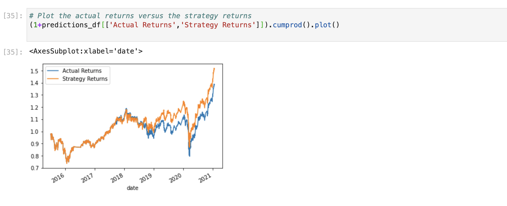

# Machine Learning Trading Bot
Improve the existing algorithmic trading system and enhance the existing algorithms trading signal with machine learning that can adopt new data.

There are the steps to do:
    
    Establish a Baseline Performance

    Tune the Baseline Trading Algorithm

    Evaluate a New Machine Learning Classifier

changing the DateOffset value will change the accuracy score,example as belove:
DateOffset(months=6)
              precision    recall  f1-score   support

        -1.0       0.02      0.44      0.04        86
         1.0       0.98      0.56      0.71      3857

    accuracy                           0.56      3943
   macro avg       0.50      0.50      0.38      3943
weighted avg       0.96      0.56      0.70      3943
DateOffset(months=3)
       precision    recall  f1-score   support

        -1.0       0.04      0.43      0.07       161
         1.0       0.96      0.56      0.71      3931

    accuracy                           0.55      4092
   macro avg       0.50      0.49      0.39      4092
weighted avg       0.92      0.55      0.68      4092

the longer time range ,the more accuracy .

by decreasing and increasing the SMA windows, both will affect the accuracy .

SVC is the best model ,the cumcumlative strategy and actual return as below.

